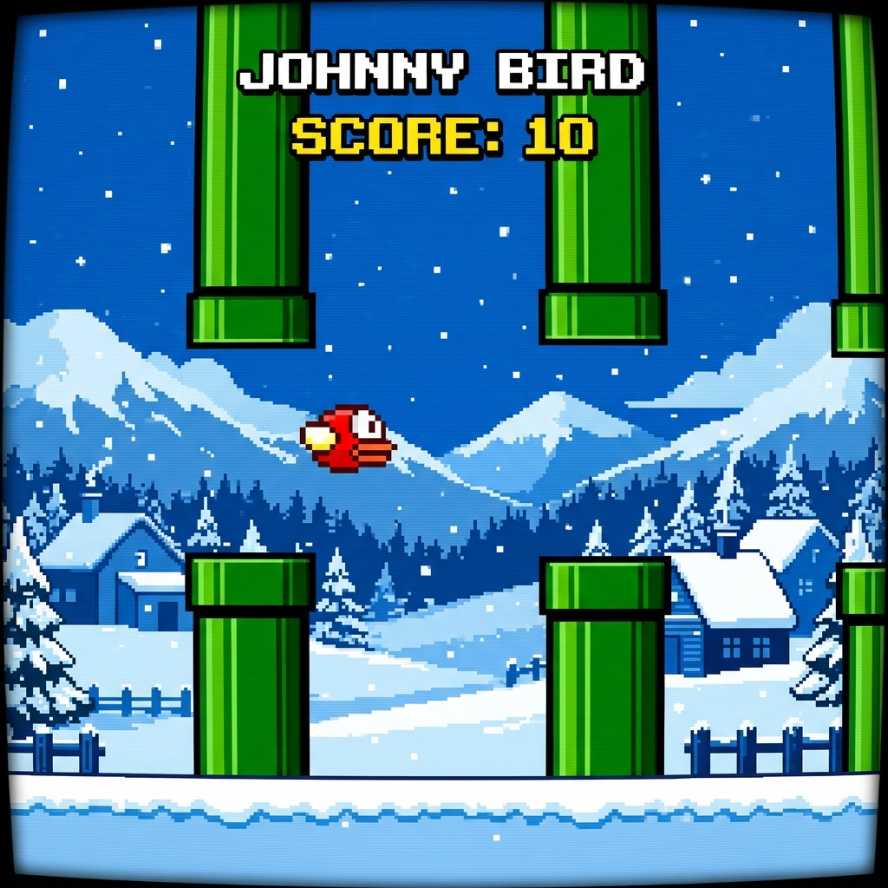

# 🐦 Johnny Bird

Johnny Bird is a premium, retro-styled Flappy Bird clone built using HTML5 Canvas, Vanilla CSS, and synthesized audio using the native Web Audio API. Play as Johnny (`O>`), Maimunah (`@_@`), or Tingo (`^_^`) and navigate through gaps between pipes in various weather themes!

## 🚀 Live Demo

You can play the game live on GitHub Pages:

*(To set up your live version: go to your GitHub repository Settings > Pages, select the `main` branch, and click Save.)*

---

## 🎮 Game Preview

---

## ✨ Features

- **Synthetic Audio**: Vintage sound effects synthesized programmatically using the Web Audio API (no external file loads required!).
  - **Wing Flaps**: Retro pitch sweeps.
  - **Point Chimes**: Clean arpeggio coin chime.
  - **Crash Sound**: Downward pitch crunch.
- **Visual Wing Flapping**: Wings dynamically rotate (`^` and `v`) based on bird vertical velocity.
- **Multiple Characters**: Select between Johnny (`O>`), Maimunah (`@_@`), or Tingo (`^_^`).
- **Dynamic Themes**: Multiple environments like Winter (with falling snowflakes), Desert (cacti and clouds), and Cloudy.
- **Smooth Gameplay**: Locked to 60 FPS.

## 🕹️ How to Play

1. Open `index.html` in your browser (or click the **Live Demo** button above).
2. Click anywhere or press any key to unlock sound and start.
3. Use the **Spacebar** (or tap the screen on mobile/tablets) to flap your wings and fly.
4. Dodge the green pipe gaps.
5. Beat your high score!

---

## 🛠️ Technical Details

- Built entirely with **HTML5 Canvas** and **Vanilla Javascript**.
- Styled using retro font families (Press Start 2P) and harmonic dark-mode layouts.
- Zero external libraries or assets, ensuring near-instant loading times.
